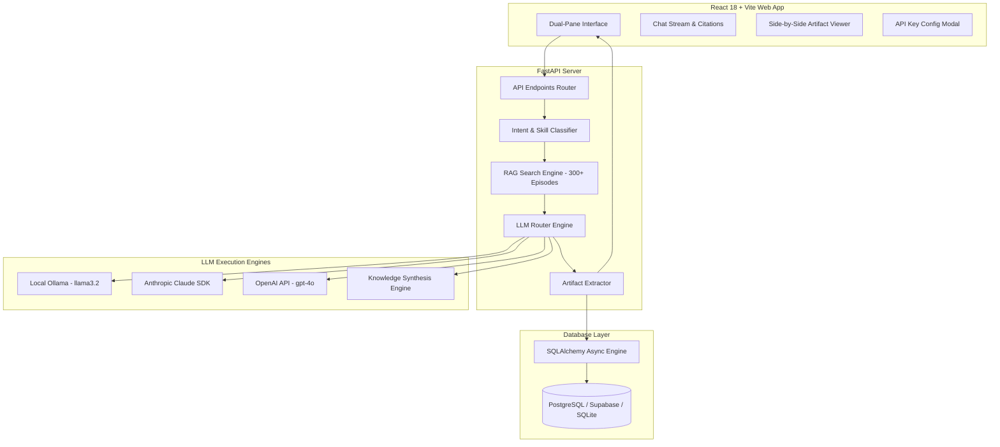
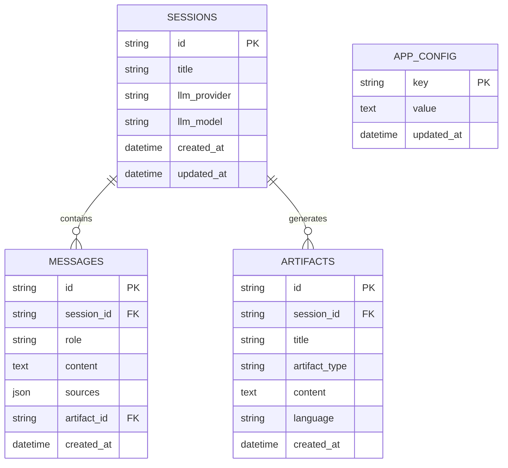

# 🏗️ Technical Architecture Document (`ARCHITECTURE.md`)

## 1. System Overview

**The Lenny Growth Assistant** is an agentic, full-stack web application designed for high-precision product management Q&A, content generation, and artifact rendering based strictly on **Lenny's Podcast transcripts**.



---

## 2. Database Schema (Supabase / Railway / PostgreSQL / SQLite)

The database schema is managed via **SQLAlchemy Async ORM** (`backend/db/models.py`) and supports PostgreSQL (Supabase/Railway) with automatic local SQLite fallback.



### Table Definitions
1. **`sessions`**: Stores active chat sessions, title, active LLM provider (`ollama`/`cloud`), and timestamps.
2. **`messages`**: Stores message history (`user` / `assistant`), full content, serialized RAG sources metadata (guest, episode title, snippet), and optional linked artifact ID.
3. **`artifacts`**: Stores generated HTML UI artifacts or Markdown documents.
4. **`app_config`**: Stores persistent configuration settings (e.g. `ANTHROPIC_API_KEY`, `OPENAI_API_KEY`).

---

## 3. API Endpoints Specification

FastAPI routers are grouped under `/api` (`backend/routes/`):

### Sessions Router (`/api/sessions`)
- **`GET /api/sessions/`**: Returns a list of all active sessions sorted by last updated time.
- **`POST /api/sessions/`**: Creates a new session with default title and provider.
- **`GET /api/sessions/{session_id}`**: Returns full session details including messages, transcript citations, and generated artifacts.
- **`PUT /api/sessions/{session_id}`**: Updates session title or model parameters.
- **`DELETE /api/sessions/{session_id}`**: Deletes the specified session and cascade deletes associated messages and artifacts.

### Chat Router (`/api/chat`)
- **`POST /api/chat/`**: Main agentic endpoint.
  - **Payload:** `{ session_id, message, is_ship30, is_artifact_request, provider, model }`
  - **Workflow:**
    1. Resolves chat memory references (`it`, `this`, `that startup`, `our product`).
    2. Runs TF-IDF transcript search with entity boosting.
    3. Evaluates score against min threshold (0.15). If query is out of domain, returns exact fallback message.
    4. Classifies intent: Normal Chat, Ship30for30 Skill, PRD Mode, Roadmap Mode, or HTML Artifact.
    5. Calls LLM Router engine and extracts generated `<artifact>`.
    6. Saves user & assistant messages to DB and returns response.

### Artifacts Router (`/api/artifacts`)
- **`GET /api/artifacts/{artifact_id}`**: Returns full content of a single artifact.

### Config Router (`/api/config`)
- **`GET /api/config/`**: Returns system status, Ollama online state, API key status, and RAG chunk counts.
- **`POST /api/config/keys`**: Dynamically updates API keys in settings and database.

---

## 4. Agentic Routing Logic & Intent Classification

```python
def classify_request(message: str, is_ship30_flag: bool = False, is_artifact_flag: bool = False) -> Dict[str, Any]:
    lower = message.lower().strip()
    
    # 1. Ship30for30 Essay Skill
    ship30_keywords = ["ship30", "ship 30", "essay", "twitter thread", "long-form content", "linkedin post"]
    is_ship30 = is_ship30_flag or any(kw in lower for kw in ship30_keywords)
    
    # 2. PRD Mode
    is_prd = "prd" in lower or "product requirements document" in lower
    
    # 3. Roadmap Mode
    is_roadmap = "roadmap" in lower
    
    # 4. HTML Artifact
    html_keywords = ["landing page", "dashboard", "website", "pricing page", "hero section", "ui", "html", "css"]
    is_html_artifact = any(kw in lower for kw in html_keywords)
    
    # 5. Markdown Artifact
    markdown_keywords = ["prd", "roadmap", "documentation", "strategy", "checklist", "plan", "notes"]
    is_markdown_artifact = is_prd or is_roadmap or any(kw in lower for kw in markdown_keywords)
    
    is_artifact = is_artifact_flag or is_html_artifact or is_markdown_artifact
    
    return {
        "is_ship30": is_ship30,
        "is_artifact": is_artifact,
        "is_html_artifact": is_html_artifact,
        "is_markdown_artifact": is_markdown_artifact,
        "is_prd": is_prd,
        "is_roadmap": is_roadmap
    }
```

---

## 5. LLM Engine Switch Architecture

The `LLMRouter` (`backend/services/llm_router.py`) handles execution routing:

1. **Local Ollama Execution:**
   - Sends requests to `OLLAMA_BASE_URL` (`http://localhost:11434/api/chat`).
2. **Cloud Execution:**
   - Routes to Anthropic Claude SDK (`anthropic.AsyncAnthropic`) if `ANTHROPIC_API_KEY` is present.
   - Routes to OpenAI API (`openai.AsyncOpenAI`) if `OPENAI_API_KEY` is present.
3. **Knowledge Synthesis Engine (Graceful Fallback):**
   - If Ollama is offline or API keys are unconfigured during local evaluation, the in-memory engine dynamically synthesizes structured responses adhering to PRD templates, Roadmap templates, HTML artifacts, and Ship30for30 essays using RAG context.
