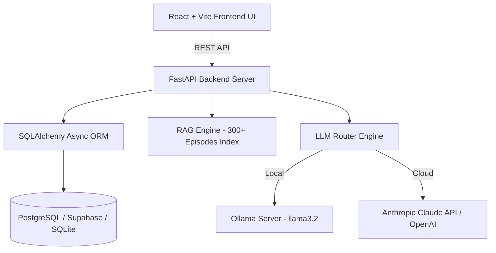

# 🚀 The Lenny Growth Assistant

A full-stack, AI-powered conversational workspace specialized in Product Management, Product-Led Growth (PLG), Startup Strategy, and Product Design—built on transcripts from **Lenny's Podcast**.

---

## 🎥 2-Minute Demo Video
[](YOUR_YOUTUBE_VIDEO_LINK_HERE)

> **Demo Video Link:** [https://youtu.be/YOUR_VIDEO_ID](YOUR_YOUTUBE_VIDEO_LINK_HERE)

---

## 🌟 Key Features

* **🎙️ Podcast Transcript RAG Engine:** Ingests and indexes over 300 episode transcripts (~27,700 chunks) from *Lenny's Podcast* (Brian Chesky, Rahul Vohra, Elena Verna, Shreyas Doshi, Marty Cagan, and more).
* **💬 ChatGPT-Style Session Management:** Start new chat sessions, search conversation history, rename threads, and maintain isolated session memory.
* **⚙️ Flexible LLM Engine Switch:** Seamlessly switch between **Local Ollama** (`llama3.2`) and **Cloud Providers** (Anthropic Claude 3.5 Sonnet / OpenAI GPT-4o) directly from the UI or `.env`.
* **✍️ Ship30for30 Content Generation Skill:** Synthesizes complex podcast insights into ~1,200-word skimmable digital essays with strong hooks, punchy short paragraphs, bold insights, bullet points, and citations.
* **🎨 Side-by-Side Artifact Viewer UI:**
  * **Interactive HTML/CSS Artifacts:** Live rendering of modern SaaS landing pages, hero sections, and dashboards inside interactive sandboxed iframes.
  * **Markdown Document Artifacts:** Live rendering of technical documents.
  * **PRD Mode:** Generates complete Product Requirements Documents adhering strictly to the 19 required PRD section headers.
  * **Roadmap Mode:** Generates structured multi-phase product roadmaps.
* **🛡️ Strict Grounding & Out-of-Domain Guard:** Restricts knowledge strictly to Lenny's Podcast transcripts. Automatically returns exact fallback responses when transcript evidence is insufficient.

---

## 🏗️ Architecture Overview

The system consists of three main decoupled layers:



1. **Frontend (React 18 + Vite + Tailwind CSS):**
   - Dual-pane layout: Chat stream on the left, Side-by-Side Artifact Workspace on the right.
   - Interactive iframe sandbox for rendering HTML UI artifacts live.
   - API key modal and real-time LLM toggle notifications (`✓ Using Local Ollama`, `✓ Switched to Claude`).

2. **Backend API (FastAPI + Python 3.10+):**
   - Asynchronous REST API routing session management, chat streaming, RAG transcript search, and artifact extraction.
   - Strict system prompt enforcement ensuring output quality and citation metadata.

3. **Database Layer (SQLAlchemy Async ORM):**
   - Persistent store for sessions, messages, sources, artifacts, and config settings.
   - Built for **Supabase / Railway PostgreSQL** (`postgresql+asyncpg://`) with automatic SQLite fallback (`lenny_growth.db`).

---

## 🛠️ Step-by-Step Local Setup & Deployment

### Prerequisites
- Python 3.10 or higher
- Node.js 18.x or higher & npm
- (Optional for Local LLM) [Ollama](https://ollama.com/) with `llama3.2` model downloaded (`ollama pull llama3.2`)

---

### 1. Environment Configuration

Clone the repository and copy `.env.example` to `.env`:

```bash
cp .env.example .env
```

To use Cloud LLM mode via environment, set your API key in `.env`:
```env
ANTHROPIC_API_KEY="sk-ant-..."
OPENAI_API_KEY="sk-proj-..."
```
*(Note: You can also configure API keys dynamically inside the web app using the UI key modal).*

---

### 2. Backend Setup & Run

1. Navigate to the project root and install dependencies:
   ```bash
   pip install -r backend/requirements.txt
   ```

2. Start the FastAPI backend server:
   ```bash
   python -m backend.main
   ```
   *The backend server will start on `http://localhost:8000`. Transcripts will be indexed automatically on initial startup.*

---

### 3. Frontend Setup & Run

1. Open a new terminal window, navigate to the `frontend` directory, and install dependencies:
   ```bash
   cd frontend
   npm install
   ```

2. Start the Vite development server:
   ```bash
   npm run dev
   ```
   *Open your browser and navigate to `http://localhost:5173`.*

---

## 🧪 Testing Locally

### Automated Test Suite
You can verify the end-to-end pipeline locally by running the automated test script:

```bash
python scratch/test_e2e_pipeline.py
```

This verifies:
- Database initialization and session creation.
- RAG index retrieval & guest entity boosting.
- Out-of-domain query guard enforcement.
- Ship30for30 essay generation skill.
- PRD Mode (all 19 required headers).
- Roadmap Mode and HTML UI Artifact rendering.

---

## 📁 Repository Structure

```
├── README.md                      # Deployment & setup documentation
├── PRD.md                         # Product Requirements Document
├── ARCHITECTURE.md                # System design & database schema
├── design.md                      # UI/UX design specifications
├── .env.example                   # Environment variable template
├── agent_transcripts/             # Mandatory agent execution transcripts
│   ├── transcript_01_initial_setup_and_rag.md
│   ├── transcript_02_llm_switch_and_ship30_skill.md
│   └── transcript_03_artifacts_and_e2e_testing.md
├── backend/                       # FastAPI Backend
│   ├── config.py                  # Configuration & settings
│   ├── main.py                    # Server application entrypoint
│   ├── requirements.txt           # Python dependencies
│   ├── db/                        # Database models & Async ORM
│   ├── routes/                    # API Routers (chat, sessions, artifacts, config)
│   ├── services/                  # RAG Engine, LLM Router & Artifact Generator
│   └── skills/                    # Ship30for30 digital writing skill
├── frontend/                      # React + Vite Frontend
│   ├── src/                       # React components & services
│   └── package.json               # Frontend dependencies
└── raw_transcripts/               # 300+ Lenny's Podcast transcripts
```

---

## 📄 License
MIT License. All transcript data sourced from *Lenny's Podcast* transcripts repository.
