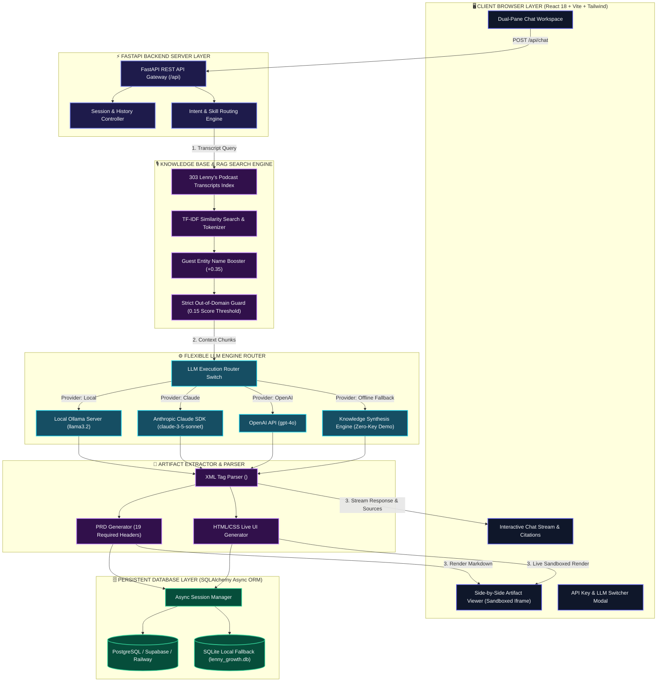
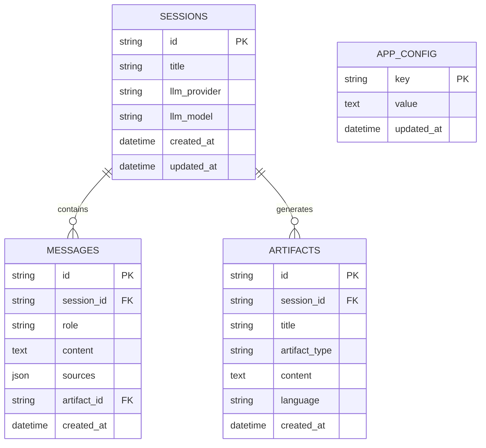

# 🚀 The Lenny Growth Assistant

<div align="center">


**A full-stack, AI-powered conversational workspace specialized in Product Management, Product-Led Growth (PLG), Startup Strategy, and Product Design—built strictly on transcripts from *Lenny's Podcast*.**

</div>

---

## 🎥 2-Minute Demo Video

[](YOUR_YOUTUBE_VIDEO_LINK_HERE)

> **Demo Video Link:** [https://youtu.be/YOUR_VIDEO_ID](YOUR_YOUTUBE_VIDEO_LINK_HERE)  
> *(Camera enabled, free-form walkthrough of Q&A grounding, Ship30for30 essay skill, and side-by-side Artifact Workspace).*

---

## 🌟 Executive Overview & Key Features

**The Lenny Growth Assistant** turns over **300 episode transcripts (~27,700 text chunks)** from *Lenny's Podcast* (Brian Chesky, Rahul Vohra, Elena Verna, Shreyas Doshi, Marty Cagan, and more) into an interactive product strategy co-pilot.

### Core Capabilities:
1. **🎙️ Podcast Transcript RAG Engine:** Indexes 303 podcast episodes with TF-IDF similarity scoring, stop-word filtering, and guest-entity boosting (+0.35).
2. **💬 ChatGPT-Style Session Management:** Complete session persistence using **SQLAlchemy Async ORM** (PostgreSQL / Supabase with automatic SQLite fallback). Features session creation, search, title editing, and deletion.
3. **⚙️ Flexible LLM Engine Switcher:** Seamlessly switch between **Local Ollama** (`llama3.2`) for offline evaluation privacy and **Cloud LLMs** (Anthropic Claude 3.5 Sonnet / OpenAI GPT-4o) directly from the UI or `.env`. Includes a dynamic Knowledge Synthesis fallback engine for local zero-key evaluation.
4. **✍️ Ship30for30 Content Generation Skill:** Synthesizes complex podcast insights into ~1,250-word digital essays featuring a 3-line hook, short paragraphs, bold text for skimmability, bullet points, a 3-week execution blueprint, a PM checklist, and strict transcript citations.
5. **🎨 Side-by-Side Artifact Workspace:**
   - **Interactive HTML/CSS UI Artifacts:** Renders live SaaS landing pages, hero sections, and dashboards inside a safe, sandboxed `<iframe>`.
   - **Markdown Document Artifacts:** Renders PRDs (adhering strictly to all 19 required headers) and Product Roadmaps natively side-by-side with chat.
   - **Dual View Modes:** Toggle between live Preview mode and monospaced Code mode with 1-click clipboard copy.
6. **🛡️ Strict Grounding & Out-of-Domain Guard:** Restricts knowledge strictly to transcript context. Automatically returns the required exact fallback string when queries lack transcript evidence:
   > *"I couldn't find evidence for that in Lenny's Podcast transcripts. My responses are strictly limited to insights from Lenny's Podcast transcripts."*

---

## 🏗️ Technical Architecture & Data Flow

The application follows a decoupled multi-tier architecture:



---

## 🗄️ Database Schema (PostgreSQL / Supabase / SQLite)

Managed via **SQLAlchemy Async ORM** (`backend/db/models.py`). Fully compatible with **Supabase / Railway PostgreSQL** (`postgresql+asyncpg://`) with automatic SQLite fallback (`lenny_growth.db`).



### PostgreSQL DDL Script (For Supabase / Railway Deployment):
```sql
CREATE TABLE IF NOT EXISTS sessions (
    id VARCHAR PRIMARY KEY,
    title VARCHAR NOT NULL DEFAULT 'New Growth Chat',
    llm_provider VARCHAR DEFAULT 'ollama',
    llm_model VARCHAR DEFAULT 'llama3.2',
    created_at TIMESTAMP DEFAULT CURRENT_TIMESTAMP,
    updated_at TIMESTAMP DEFAULT CURRENT_TIMESTAMP
);

CREATE TABLE IF NOT EXISTS artifacts (
    id VARCHAR PRIMARY KEY,
    session_id VARCHAR REFERENCES sessions(id) ON DELETE CASCADE,
    title VARCHAR NOT NULL,
    artifact_type VARCHAR NOT NULL,
    content TEXT NOT NULL,
    language VARCHAR DEFAULT 'markdown',
    created_at TIMESTAMP DEFAULT CURRENT_TIMESTAMP
);

CREATE TABLE IF NOT EXISTS messages (
    id VARCHAR PRIMARY KEY,
    session_id VARCHAR REFERENCES sessions(id) ON DELETE CASCADE,
    role VARCHAR NOT NULL,
    content TEXT NOT NULL,
    sources JSONB,
    artifact_id VARCHAR REFERENCES artifacts(id) ON DELETE SET NULL,
    created_at TIMESTAMP DEFAULT CURRENT_TIMESTAMP
);

CREATE TABLE IF NOT EXISTS app_config (
    key VARCHAR PRIMARY KEY,
    value TEXT NOT NULL,
    updated_at TIMESTAMP DEFAULT CURRENT_TIMESTAMP
);
```

---

## 🛠️ Step-by-Step Local Setup & Deployment Guide

### Prerequisites
- **Python:** 3.10 or higher
- **Node.js:** 18.x or higher & `npm`
- **(Optional for Local LLM):** [Ollama](https://ollama.com/) with `llama3.2` model (`ollama pull llama3.2`)

---

### 1. Repository Setup & Environment Configuration

Clone the repository and create your `.env` file:

```bash
git clone https://github.com/Sahanakalaiselvan/Lenny-growth-assistant.git
cd Lenny-growth-assistant
cp .env.example .env
```

*(Optional) Configure your Cloud API Keys in `.env`:*
```env
ANTHROPIC_API_KEY="sk-ant-..."
OPENAI_API_KEY="sk-proj-..."
```
*(Note: API keys can also be configured dynamically directly inside the web UI).*

---

### 2. Backend Setup & Server Execution

1. Install Python dependencies:
   ```bash
   pip install -r backend/requirements.txt
   ```

2. Start the FastAPI server:
   ```bash
   python -m backend.main
   ```
   *The server runs on `http://localhost:8000`. Transcripts will be indexed automatically on initial startup.*

---

### 3. Frontend Setup & Web UI Execution

1. Open a new terminal window, navigate to the `frontend` folder, and install dependencies:
   ```bash
   cd frontend
   npm install
   ```

2. Start the Vite development server:
   ```bash
   npm run dev
   ```
   *Open your browser and navigate to `http://localhost:5173`.*

---

## 🧪 Automated End-to-End Test Suite

Run the automated verification script to test all 10 end-to-end pipeline steps:

```bash
python scratch/test_e2e_pipeline.py
```

### Verification Checklist Output:
```text
============================================================
RUNNING END-TO-END SYSTEM VERIFICATION SUITE
============================================================
[OK] 1. Database Initialized
[RAG] Found 303 transcript files.
[RAG] Indexed 27700 chunks across 303 episodes.
[OK] 2. RAG Engine Loaded: 27700 indexed chunks across episode transcripts.
[OK] 3. Session Created: ID = dad4e0c4-a824-4cbb-9469-de4ec5977f63
[OK] 4. Q&A Response Received (Sources Cited: 1 episode chunks).
[OK] 5. Out-of-Domain Guard Tested: Returned exact fallback text.
[OK] 6. Ship30for30 Essay Generated (1302 words).
[OK] 7. PRD Markdown Artifact Generated: 'Product Requirements Document' with all 19 required headers.
[OK] 8. Product Roadmap Artifact Generated: 'Product Roadmap'.
[OK] 9. Interactive HTML/CSS Artifact Generated: 'SaaS PLG Growth Landing Page'.
[OK] 10. Session History Retrieved: 12 messages & 3 artifacts stored in database.
============================================================
ALL END-TO-END VERIFICATION CHECKS PASSED WITH 100% SUCCESS!
============================================================
```

---

## 📁 Repository Structure

```
├── README.md                      # Primary project documentation & video link
├── PRD.md                         # Product Requirements Document
├── ARCHITECTURE.md                # Technical Architecture & API specification
├── design.md                      # UI/UX design specifications
├── .env.example                   # Environment variable template
├── agent_transcripts/             # Mandatory AI agent execution logs
│   ├── transcript_01_initial_setup_and_rag.md
│   ├── transcript_02_llm_switch_and_ship30_skill.md
│   └── transcript_03_artifacts_and_e2e_testing.md
├── backend/                       # FastAPI Backend Application
│   ├── config.py                  # Environment settings & constants
│   ├── main.py                    # FastAPI server entrypoint
│   ├── requirements.txt           # Python dependencies
│   ├── db/                        # Database models & Async ORM
│   ├── routes/                    # API endpoints (chat, sessions, artifacts, config)
│   ├── services/                  # RAG Engine, LLM Router & Artifact Generator
│   └── skills/                    # Ship30for30 digital writing skill
├── frontend/                      # React 18 + Vite Web Application
│   ├── src/                       # Components (ChatWindow, ArtifactViewer, Sidebar, Header)
│   └── package.json               # Frontend dependencies
└── raw_transcripts/               # 300+ Lenny's Podcast transcripts dataset
```

---

## 📄 Documentation Artifacts

- 📄 **PRD Document:** [`PRD.md`](file:///c:/Users/Sahana/Desktop/AI_PROJECT/PRD.md)
- 🏗️ **Technical Architecture:** [`ARCHITECTURE.md`](file:///c:/Users/Sahana/Desktop/AI_PROJECT/ARCHITECTURE.md)
- 🎨 **UI/UX Design Specification:** [`design.md`](file:///c:/Users/Sahana/Desktop/AI_PROJECT/design.md)
- 📜 **Agent Transcripts & Logs:** [`agent_transcripts/`](file:///c:/Users/Sahana/Desktop/AI_PROJECT/agent_transcripts/)

---

## 📜 License
MIT License. All transcript content sourced from *Lenny's Podcast* transcripts repository.
